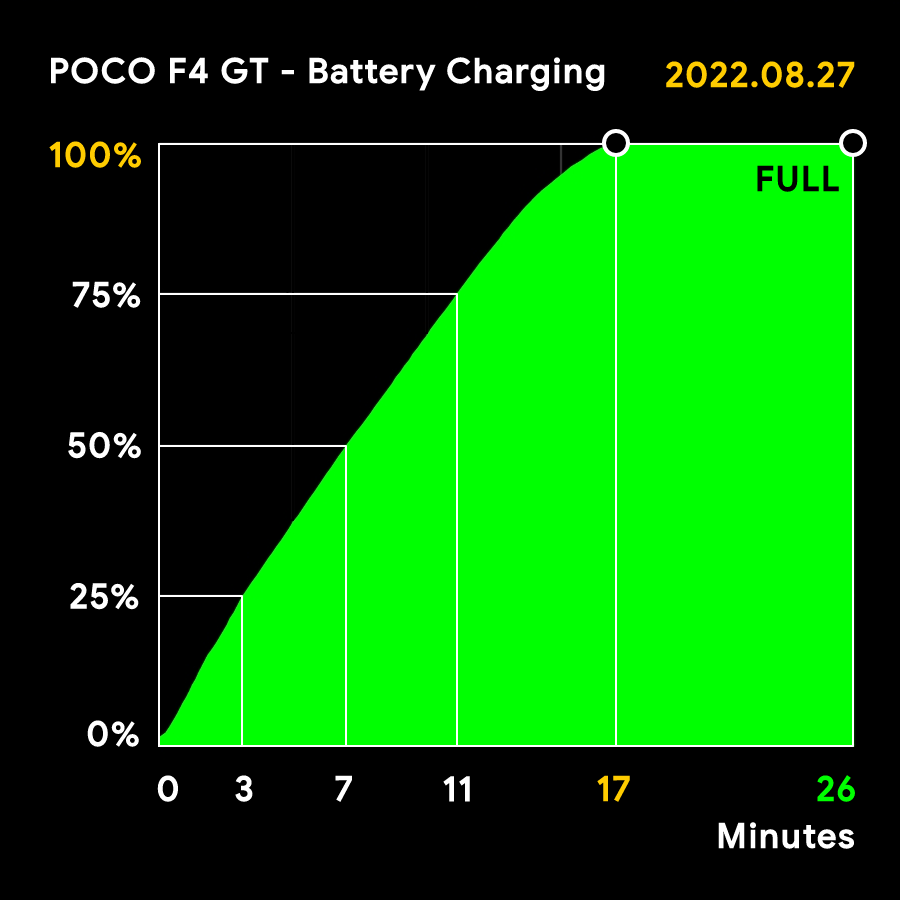

# Battery Tests
## About the Battery
The battery on Poco F4 GT is said to being 4700mAh, but this is just a nominal and theorical value. The actual capacity starts descreasing with time from the moment a phone battery is manufactured.

Using conditions like temperature, voltage and charging profile also wears out the battery. So it's a good ideia to check on the battery health from time to time.

To prolong the battery life span, you can charge from 20% to 80%, avoiding drowning it completely to 0%, or staying at a full 100% charge for hours.

High temperature can also be harmful to the battery, so let the phone alone with the screen off during charging, and use a cooler during long gaming sessions.

The tests in this page uses full charges, so they create much stress on the battery, and should **not** be done often. They are needed, though, to estimate how much charge the battery actually holds from its ideal 4700mAh capacity.

## About the Apps
**Battery Log** collects battery data like time, level, temperature, voltage, and status, every time a battery event occour, like level changing, and charging star/end. It's a tool to help analysing the results.

**AccuBattery**, **AnTuTu Benchmark**, **Battery Guru**, and **Franco Kernel Manager (FKM)** are the apps put to test for estimating the actual current battery capacity.

To get valid results, enable the "dual cell battery" mode in each app, when available.

## About the Tests
The tests are done by charging the phone using the stock USB cable, with the "Boost charging speed" option disable on MIUI settings, the screen off most of the time, WiFi and Bluetooth disabled, and almost all apps force closed using Greenify, except for the ones in test. This minimizes battery usage to get a full speed charging.

The battery capacity estimation is done by counting how much energy (mA) goes into the battery during a least one long charging session, preferably from 1% to 100%, a 99% charge. From this, the apps project the equivalent 100% charge value, and that's the battery capacity estimation.

This is not hard science, and each app takes a different approach, and gives different results. The battery information given by the system is also [not always reliable](https://batteryuniversity.com/article/recognizing-battery-capacity-as-the-missing-link), so each test may be different even on the same app.

Finally, when the battery reaches 100%, it's actually not really fully charged. After that, it still continues to charge for many minutes, untill a FULL status is reached. It's interesting to see how apps do handle this, or don't.

## 2022.08.27 Test


### Battery Log

Plug:
```
1% - 15:16:26
```

Charging:
```
 25% in  3m - 15:19:40
 50% in  7m - 15:23:32
 75% in 11m - 15:27:38
100% in 17m - 15:33:47
FULL in 26m - 15:42:23
```

Unplug:
```
100% - 16:19:49
```

Battery Log shows the charging toke 17 minutes to get from 1% to 100%, but 26 minutes to an actual FULL status.

### AccuBattery v2.0.1 beta
Charging Session:
```
Start: 15:16
End:   15:47
Total: 31m
```

Battery Capacity:
```
Charged:   4396   mAh
Estimated: 4440.7 mAh
Health:    94%
```

AccuBattery estimates a 4440.7 mAh full charge, 94% of an ideal 4700 mAH battery capacity. It kept recording the charge added to the battery for 5 minutes after the FULL status. As the app states in [this page](https://accubattery.zendesk.com/hc/en-us/articles/209507189-Tab-3-battery-health-screen):

*"Some devices show 100% before they are truly done, please make sure you keep the charger plugged in until AccuBattery determines that the charge is done. This may take 1 to 2 hours."* 

That's why I just turned the screen on to check if the test was complete, and unplugged the charging cable 1h after the test has started.

The value of 94% is fine, taking into account that there are some variation on each battery unit, and Poco is a budget brand with probably a not optimal quality control.

Also new devices don't actually let a 0% status, turning the phone off automatically before you can start a charging test. It may also be doing the same on the other side, stopping charging before the battery is really full, to prevent stress and protect the battery.

There's also the fact that it's a dual cell battery phone, so there's actually two 2350 mAh batteries inside it, charging and discharging at the same time. It could include some extra protection.

AccuBattery was the app with the bigger battery capacity estimation, and it seems to be the most accurate. So it's is my recommendation for the Poco F4 GT.

### AnTuTu Benchmark v9.3.9
Charging Session:
```
End:   15:33
Total: 17m
```

Battery Capacity:
```
Estimated: 4068 mAh
Health:    87%
```

AnTuTu doesn't actually tell the charged amount it considered, but comparing the End time with the Battery Log info, it seems to have counted the charge added only until the 100% status was reached.

Because of that, it doesn't seem reliable as a measure app for the battery capacity on the Poco F4 GT, giving a too low value for a new device.

Batteries charged once a day are expected to lose about 15% of capacity after one year. My phone is 3 months old, and always charged from 40% to 80%. It certainly didn't lose 13% capacity. Next app.

### Battery Guru v.1.9.31
Charging Session:
```
Start: 15:16:27
End:   16:19:48
Total: 1h 3m 20s
```

Battery Capacity:
```
Charged:   4062.4 mAh
Estimated: 4103   mAh
Health:    88%
```

BatteryGuru gives pretty much the same result as AnTuTu. It just counted a little less of charge, end estimates a little more of capacity.

As AnTuTu, BatteryGuru certainly didn't count any charge past the 100% status, even though it states the End time as the Unplug time seeing in the Battery Log info.

Interesting, but equality unreliable. Next app.

### Franco Kernel Manager v6.1.13
Battery Capacity:
```
Learned: 3972 mAh
Health:  84%
```

FKM has the lowest estimative of 84% battery capacity, and it doesn't provide info about the time of charging session, so I can't assume how it could conclude my battery has loosen 16% of its capacity.

Something has gone really wrong here.

### Conclusion
Use AccuBattery and you're good to go.

### Screenshots
- Battery Log: [Screenshot 1](../../raw/main/images/battery-test-20220827-1-batterylog.jpg)
- AccuBattery: [Screenshot 1](../../raw/main/images/battery-test-20220827-2-accubattery.jpg)
- AnTuTu Benchmark: [Screenshot 1](../../raw/main/images/battery-test-20220827-3-antutu-1.jpg), [Screenshot 2](../../raw/main/images/battery-test-20220827-3-antutu-2.jpg)
- Battery Guru: [Screenshot 1](../../raw/main/images/battery-test-20220827-4-batteryguru-1.jpg), [Screenshot 2](../../raw/main/images/battery-test-20220827-4-batteryguru-2.jpg)
- Franco Kennel Manager: [Screenshot 1](../../raw/main/images/battery-test-20220827-5-fkm-1.jpg), [Screenshot 2](../../raw/main/images/battery-test-20220827-5-fkm-2.jpg)
