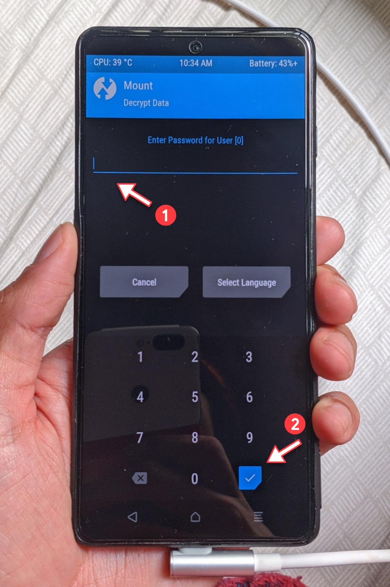
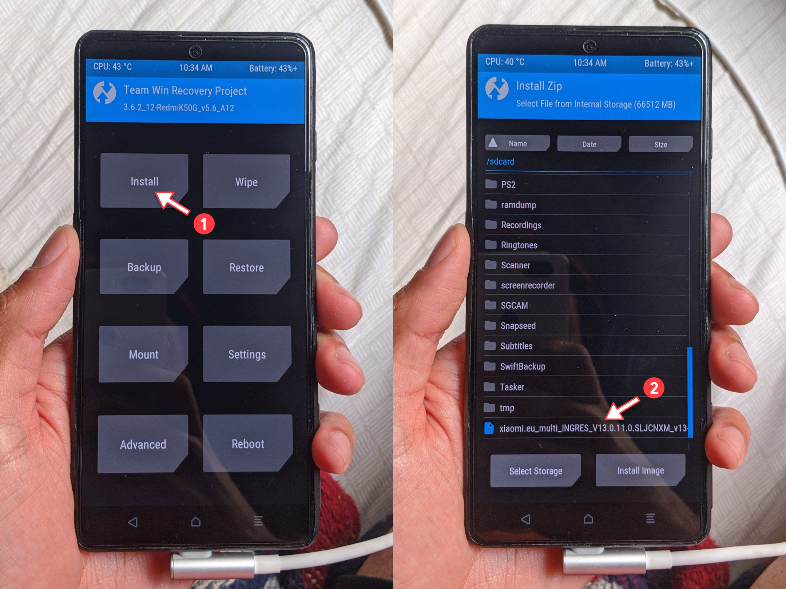
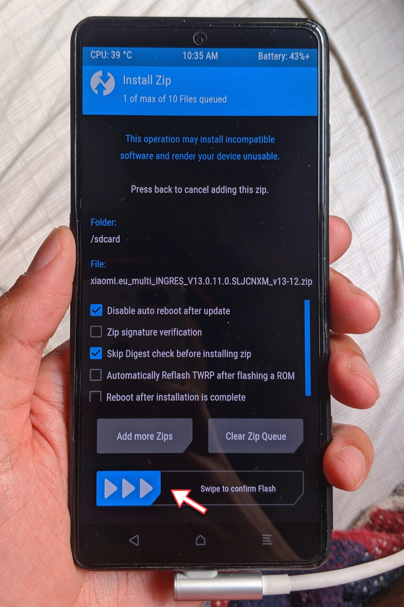

# Como atualizar a Xiaomi.eu na Recovery
## Sobre
A Xiaomi.eu versão 13.0.11 lançada em 24/08/2022 é uma ROM Recovery, então é preciso usar o TWRP para instalação.

Esse guia é indicado se você está na Xiaomi.eu instalada por script no Fastboot, e quer atualizar para a versão 13.0.11 Recovery, mas sem instalar o TWRP no celular.

Se você está na MIUI Stock e quer instalar a Xiaomi.eu pela primeira vez, esse tutorial não tem todos os passos e não é indicado.

## Você precisa
- Estar na Xiaomi.eu com Bootloader desbloqueado.
- Ter Depuração ADB ativa e Fastboot funcionando corretamente no computador.
- Baixe a [ROM da Xiaomi.eu 13.0.11](https://sourceforge.net/projects/xiaomi-eu-multilang-miui-roms/files/xiaomi.eu/MIUI-STABLE-RELEASES/MIUIv13/xiaomi.eu_multi_INGRES_V13.0.11.0.SLJCNXM_v13-12.zip/download) no celular.
- Baixe o [TWRP pro ingres versão Boot](https://dl.akr-developers.com/?file=skkk/TWRP/A12/v5.6_A12/%5BBOOT%5D3.6.2_12-RedmiK50G_v5.6_A12-ingres-skkk_427a1bbc.zip) no computador.

## Passo a Passo
### Passo 1
Reinicie o celular no modo Fastboot. Você pode desligar e depois apertar os botões Ligar e Aumentar Volume ao mesmo tempo.

### Passo 2
Conecte o celular ao computador pelo cabo USB e confirme que ele foi reconhecido pelo ADB usando o comando: 
```
fastboot devices
```

### Passo 3
Entre no TWRP sem intala-lo no celular usando o comando abaixo, trocando `"twrp.img"` pelo caminho correto. Você pode arrastar e soltar o arquivo do TWRP para a janela de comandos para colar o caminho.
```
fastboot boot "twrp.img"
```

### Passo 4
O TWRP vai iniciar e você já pode desconectar o celular do computador, se quiser. Quando a inicialização terminar, digite a senha para descriptografar o sistema e confirme.


### Passo 5
Toque em **Install** e selecione o arquivo da ROM da Xiaomi.eu no armazenamento.


### Passo 6
Arraste a **seta azul** para iniciar a instalação.


### Passo 7
**Passo final**: Quando o processo terminar, toque em **Reboot System**. O sistema vai iniciar e a instalação foi concluída com sucesso.

### Passo 8
**Opcional**: Se você tinha feito Root no sistema e/ou usou o KonaBess para modificar a GPU, é necessário refazer esses procedimentos. Depois disso, pode ser necessário corrigir apps que iniciam com o sistema e usam Root, como o Magisk (especialmente com a opção Hide, que muda o nome do pacote) ou o FKM. Para isso, desative e ative de novo a opção de "Inicio automático" na tela de Informações do app.


