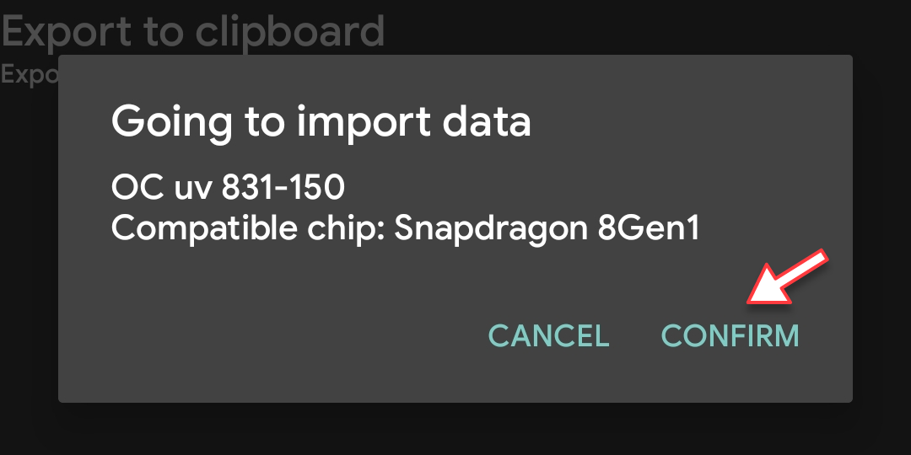

# Como usar o KonaBess
**Autor**: Paulo José Amaro @paulotwain  
**Versão**: 0.1.0  
**Criação**: 2022.07.17  
**Última edição**: 2022.07.21

## Idioma original
- English: [How To Use KonaBess](../how-to-use-konabess.md)

## Sobre
Este artigo vai te guiar em como usar o app KonaBess para fazer overclock e undervolt da GPU, e faz parte do projeto [POCO F4 GT - Docs](README.md).

É indicado a iniciantes e foi testado no celular POCO F4 GT.

Acesse [Otimizando a bateria](README.md#otimizando-a-bateria) para saber como o procedimento nesse guia pode ser útil.

**Aviso**: Este procedimento pode fazer seu celular não ligar, se feito incorretamente. Por favor, leia todas as instruções com cuidado e tenha certeza que entendeu o que está fazendo. Leve o tempo que precisar até se sentir bem confiante.

## Índice
- [Você precisa](#você-precisa)
- [Passo a passo](#passo-a-passo)
- [E depois?](#e-depois)
- [Como reverter?](#como-reverter)

## Você precisa
- **Root**. Acesse [Fazendo Root no Android](README.md#fazendo-root-no-android).
- [**KonaBess**](https://github.com/libxzr/KonaBess/releases/tag/v0.16), do GitHub. Acesse [Como instalar apps de fontes desconhecidas](como-instalar-apps-de-fontes-desconhecidas). Esse guia usa a versão 0.16 beta. Outras versões podem funcionar diferente.
- Baixe o arquivo [**Config KonaBess**](arquivo-config-konabess.md) e deixe ele na pasta de Download.
- [**Franco Kernel Manager**](https://play.google.com/store/apps/details?id=com.franco.kernel), da Play Store. Opcional pra verificar o sucesso desse guia, mas será necessário no guia [Como evitar desperdício de CPU](como-evitar-desperdicio-de-cpu.md), então é recomendado.
- App **Arquivos**, incluso na MIUI.

## Passo a passo

### Passo 1
Abra o **KonaBess**. Quando ele pedir acesso Root, toque em **PERMITIR**.

### Passo 2
Selecione o chipset "**4 Snapdragon 8Gen1"**.

### Passo 3
Toque em **BACKUP OLD IMAGE** para fazer backup da partição do sistema que será modificada. Toque em **OK** pra confirmar.

### Passo 4
Quando o KonaBess pedir acesso ao armazenamento, toque em "**Permitir apenas durante o uso do app**".

### Passo 5
Abra o app **Arquivos** e confirme se há um novo arquivo "**vendor_boot.img**" em **Dispositivo**. Você não precisa fazer nada com esse arquivo, só deixe ele seguro pro caso de precisar. É uma boa ideia salvá-lo no computador.

### Passo 6
De volta ao KonaBess, toque em **IMPORT/EXPORT**.

### Passo 7
Toque em "**Export to file**" para fazer backup da configuração original da GPU em um arquivo de texto. Assim, será fácil se você quiser reverter as modificações usando apenas o KonaBess, sem ter que mexer com imagens de partição.

### Passo 8
Digite "**GPU Stock Backup**" no campo de texto e toque em **CONFIRM**. Essa mensagem aparecerá quando o backup for importado.

### Passo 9
Abra o app **Arquivos** para confirmar se há um novo arquivo "**konabess-\*\*\*.txt**" em **Dispositivo**, onde **\*\*\*** é um número longo. Você não precisa fazer nada com esse arquivo, apenas mantenha-o seguro caso precise. O número longo é apenas a hora atual no formato "mês dia hora minuto segundo".

### Passo 10
De volta ao KonaBess, toque em "**Import from file**".

### Passo 11
Selecione o arquivo "**konabess.config-by.luki2411-for.snapdragon8gen1.txt**" na pasta Download. Ele contém novas frequências para a GPU, com melhor performance e menor gasto de bateria.

### Passo 12
Toque em **OK** para confirmar a importação.

### Passo 13
**Opcional**: O próximo passo irá aplicar as modificações, então se você quiser verificar como está a GPU antes disso, abra o **Franco Kernel Manager**, conceda acesso Root, e toque em **GPU** para abrir as opções de GPU Control. **Maximum** e **Minimum GPU Frequency** devem mostrar os valores de fábrica de **791 MHz** e **220 MHz**. Esses valores vão mudar após o Passo final.

### Passo 14
**Passo final**: É o momento de aplicar as modificações na GPU. De volta ao KonaBess, toque em **REPACK AND FLASH NEW IMAGE**. O KonaBess fará tudo sozinho e bem rápido, só não saia do app até ele terminar.

### Passo 15
O KonaBess mostrará algumas informações enquanto aplica as modificações e pedirá pra reiniciar o celular no final. Toque em **SIM**, ou reinicie manualmente quando estiver pronto.

### Passo 16
**Opcional**: Quando o celular reiniciar, para verificar se as modificações foram aplicadas com sucesso, abra o **Franco Kernel Manager** e toque em **GPU** para abrir as opções de GPU Control. Agora **Maximum** e **Minimum GPU Frequency** devem mostrar os novos valores de **810 MHz** e **150 MHz**.

Note que se você tocar nas frequências no Franco Kernel Manager, é possível troca-las. Mas isso não é necessário, porque o sistema irá ajustá-las sozinho.

Curiosamente, se você selecionar a frequência máxima de 831 MHz, ela sempre voltará a 810 MHz. Parece que a MIUI limita a frequência máxima da GPU à segunda maior. Às vezes ela diminui pra 720 MHz. Não se preocupe, isso é normal.

## E depois?
Agora a GPU está trabalhando com frequências mais eficientes, e esse é o objetivo do processo de overclock e undervolt. 

Você deve notar uma melhora na vida útil da bateria, especialmente durante o uso leve. Também deve conseguir uma pontuação levemente mais alta de GPU em apps de benchmark como o AnTuTu.

Você pode desinstalar o KonaBess se quiser, porque as modificações são permanentes no sistema e o aplicativo não precisa estar em execução.

Mas toda vez que a ROM for atualizada ou reinstalada, as frequências da GPU voltarão aos valores de fábrica e você precisará refazer este guia. Por isso, pode ser bom deixar o KonaBess instalado para uso futuro.

O Franco Kernel Manager será necessário no guia [Como evitar desperdício de CPU](como-evitar-desperdicio-de-cpu.md), então deixe ele instalado também.

## Como reverter?
### Jeito fácil
Para desfazer as modificações, você pode usar o KonaBess com a opção "**Import from file**" do [Passo 10](#passo-10) para selecionar o arquivo de backup "**konabess-\*\*\*.txt**" salvo no [Passo 7](#passo-7). Depois toque em "**REPACK AND FLASH NEW IMAGE**" e reinicie o celular.

### Jeito difícil
Outra opção avançada para voltar aos valores de fábrica é usar o ADB para fazer flash do backup da partição "**vendor_boot.img**" salvo no [Passo 3](#passo-3):
1. Conecte o telefone a um computador via cabo USB e certifique-se de que a **Depuração USB** esteja habilitada nas Opções do desenvolvedor.
2. Copie o arquivo "**vendor_boot.img**" para a pasta Download do computador.
3. Reinicie o telefone no modo **Fastboot** pressionando os botões de volume para baixo + liga/desliga.
4. Abra uma janela de linha de comando na pasta Download.
5. Execute os comandos:
      
	`fastboot flash vendor_boot_a "vendor_boot.img"`
    
    `fastoboot flash vendor_boot_b "vendor_boot.img"`
    
    `fastboot restart`

6. O celular reiniciará com os valores de fábrica da GPU.